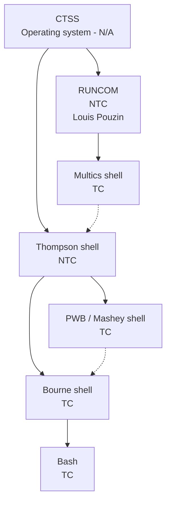

mermaid

```mermaid

flowchart TD
    CTSS["CTSS<br/>Operating system - N/A"]
    RUNCOM["RUNCOM<br/>NTC<br/>Louis Pouzin"]
    MULTICS["Multics shell<br/>TC"]
    THOMPSON["Thompson shell<br/>NTC"]
    PWB["PWB / Mashey shell<br/>TC"]
    BOURNE["Bourne shell<br/>TC"]
    BASH["Bash<br/>TC"]

    CTSS --> RUNCOM
    RUNCOM --> MULTICS
    CTSS --> THOMPSON
    MULTICS -.-> THOMPSON
    THOMPSON --> PWB
    THOMPSON --> BOURNE
    PWB -.-> BOURNE
    BOURNE --> BASH
```

Legend:

- TC = Turing Complete
- NTC = Not Turing Complete
- CTSS = Operating system; TC/NTC distinction does not apply.
